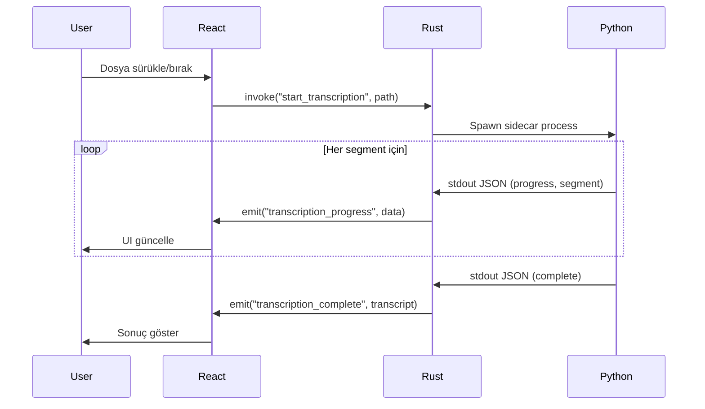

# Design Document: ScriptGrab Transcriber

## Overview

ScriptGrab, Tauri v2 (Rust) backend, React + TypeScript frontend ve Python sidecar mimarisi kullanan bir masaüstü transkript uygulamasıdır. Uygulama, OpenAI Whisper modelini yerel olarak çalıştırarak ses ve video dosyalarını metne çevirir.

### Mimari Yaklaşım

```
┌─────────────────────────────────────────────────────────────────┐
│                        ScriptGrab                                │
├─────────────────────────────────────────────────────────────────┤
│  ┌─────────────────────────────────────────────────────────┐    │
│  │                 React Frontend (Vite)                    │    │
│  │  ┌─────────┐  ┌─────────────┐  ┌──────────────────┐     │    │
│  │  │ Sidebar │  │ Main Stage  │  │ Wavesurfer.js    │     │    │
│  │  │ History │  │ Drop Zone   │  │ Audio Player     │     │    │
│  │  │ Settings│  │ Transcript  │  │ Waveform         │     │    │
│  │  └─────────┘  └─────────────┘  └──────────────────┘     │    │
│  └─────────────────────────────────────────────────────────┘    │
│                              │                                   │
│                    Tauri IPC (invoke/emit)                       │
│                              │                                   │
│  ┌─────────────────────────────────────────────────────────┐    │
│  │                 Rust Backend (Tauri v2)                  │    │
│  │  ┌──────────────┐  ┌─────────────┐  ┌───────────────┐   │    │
│  │  │ File Handler │  │ Sidecar Mgr │  │ Storage/DB    │   │    │
│  │  │ Tray Icon    │  │ Event Emit  │  │ Settings      │   │    │
│  │  │ Updater      │  │ Queue Mgr   │  │ Logging       │   │    │
│  │  └──────────────┘  └─────────────┘  └───────────────┘   │    │
│  └─────────────────────────────────────────────────────────┘    │
│                              │                                   │
│                    Subprocess (stdout/stderr)                    │
│                              │                                   │
│  ┌─────────────────────────────────────────────────────────┐    │
│  │           Python Sidecar (whisper-engine.exe)            │    │
│  │  ┌──────────────────┐  ┌─────────────────────────────┐  │    │
│  │  │ whisper-timestamped │  │ Model Manager            │  │    │
│  │  │ Audio Processing │  │ Progress Reporter          │  │    │
│  │  └──────────────────┘  └─────────────────────────────┘  │    │
│  └─────────────────────────────────────────────────────────┘    │
└─────────────────────────────────────────────────────────────────┘
```

## Architecture

### Katman Yapısı

1. **Presentation Layer (React)**: UI bileşenleri, animasyonlar, kullanıcı etkileşimleri
2. **Application Layer (Rust)**: İş mantığı, dosya işlemleri, sidecar yönetimi
3. **AI Layer (Python)**: Whisper model çalıştırma, ses işleme

### Veri Akışı



## Components and Interfaces

### Frontend Bileşenleri

#### 1. App.tsx (Ana Konteyner)
```typescript
interface AppState {
  currentView: 'idle' | 'processing' | 'result';
  currentFile: FileInfo | null;
  transcript: Transcript | null;
  queue: QueueItem[];
  settings: Settings;
}
```

#### 2. Sidebar Component
```typescript
interface SidebarProps {
  historyItems: HistoryItem[];
  onHistorySelect: (id: string) => void;
  onHistoryDelete: (id: string) => void;
  onSettingsClick: () => void;
}

interface HistoryItem {
  id: string;
  fileName: string;
  filePath: string;
  date: Date;
  duration: number;
  language: string;
}
```

#### 3. DropZone Component
```typescript
interface DropZoneProps {
  onFileDrop: (files: File[]) => void;
  onFileSelect: () => void;
  isProcessing: boolean;
}
```

#### 4. TranscriptViewer Component
```typescript
interface TranscriptViewerProps {
  transcript: Transcript;
  currentTime: number;
  searchQuery: string;
  onWordClick: (timestamp: number) => void;
  onSegmentEdit: (segmentId: string, newText: string) => void;
}

interface Transcript {
  segments: Segment[];
  language: string;
  duration: number;
}

interface Segment {
  id: string;
  start: number;
  end: number;
  text: string;
  words: Word[];
}

interface Word {
  word: string;
  start: number;
  end: number;
}
```

#### 5. AudioPlayer Component (Wavesurfer.js)
```typescript
interface AudioPlayerProps {
  audioPath: string;
  onTimeUpdate: (time: number) => void;
  onSeek: (time: number) => void;
}
```

#### 6. ProcessingView Component
```typescript
interface ProcessingViewProps {
  fileName: string;
  progress: number;
  status: string;
  queue: QueueItem[];
  onQueueReorder: (fromIndex: number, toIndex: number) => void;
}
```

### Backend Tauri Commands

```rust
// Sistem kontrolleri
#[tauri::command]
async fn check_ffmpeg() -> Result<bool, String>;

// Dosya işlemleri
#[tauri::command]
async fn start_transcription(
    app: AppHandle,
    file_path: String,
    model_size: String
) -> Result<String, String>;

#[tauri::command]
async fn cancel_transcription(job_id: String) -> Result<(), String>;

// Kuyruk yönetimi
#[tauri::command]
async fn add_to_queue(file_paths: Vec<String>) -> Result<Vec<QueueItem>, String>;

#[tauri::command]
async fn reorder_queue(from_index: usize, to_index: usize) -> Result<(), String>;

// Geçmiş
#[tauri::command]
async fn get_history() -> Result<Vec<HistoryItem>, String>;

#[tauri::command]
async fn delete_history_item(id: String) -> Result<(), String>;

#[tauri::command]
async fn load_history_item(id: String) -> Result<TranscriptData, String>;

// Dışa aktarma
#[tauri::command]
async fn export_transcript(
    transcript: TranscriptData,
    format: ExportFormat,
    output_path: String
) -> Result<(), String>;

// Model yönetimi
#[tauri::command]
async fn check_model_exists(model_size: String) -> Result<bool, String>;

#[tauri::command]
async fn download_model(app: AppHandle, model_size: String) -> Result<(), String>;

#[tauri::command]
async fn delete_model(model_size: String) -> Result<(), String>;

#[tauri::command]
async fn get_model_info() -> Result<Vec<ModelInfo>, String>;

// Ayarlar
#[tauri::command]
async fn get_settings() -> Result<Settings, String>;

#[tauri::command]
async fn save_settings(settings: Settings) -> Result<(), String>;

// Loglama
#[tauri::command]
async fn open_log_folder() -> Result<(), String>;
```

### Python Sidecar Interface

```python
# whisper_engine.py - stdout JSON protokolü

# Progress mesajı
{"type": "progress", "percent": 35, "status": "Processing audio..."}

# Segment mesajı
{
    "type": "segment",
    "data": {
        "id": "seg_001",
        "start": 0.0,
        "end": 3.5,
        "text": "Hello world",
        "words": [
            {"word": "Hello", "start": 0.0, "end": 0.8},
            {"word": "world", "start": 0.9, "end": 1.5}
        ]
    }
}

# Tamamlanma mesajı
{
    "type": "complete",
    "language": "en",
    "duration": 120.5
}

# Hata mesajı
{"type": "error", "message": "Model not found"}
```

## Data Models

### Storage Schema (SQLite veya JSON)

```typescript
// Transcript Storage
interface StoredTranscript {
  id: string;
  fileName: string;
  filePath: string;
  createdAt: string;
  duration: number;
  language: string;
  modelSize: string;
  segments: Segment[];
}

// Settings Storage
interface Settings {
  modelSize: 'base' | 'small' | 'medium';
  minimizeToTray: boolean;
  defaultExportFormat: 'txt' | 'srt' | 'json';
  autoCheckUpdates: boolean;
}

// Queue Item
interface QueueItem {
  id: string;
  filePath: string;
  fileName: string;
  status: 'pending' | 'processing' | 'completed' | 'error';
  progress: number;
  addedAt: string;
}
```

### Export Formats

```typescript
// TXT Format
"Hello world. This is a test."

// SRT Format
1
00:00:00,000 --> 00:00:03,500
Hello world.

2
00:00:03,600 --> 00:00:06,200
This is a test.

// JSON Format
{
  "language": "en",
  "duration": 6.2,
  "segments": [
    {
      "start": 0.0,
      "end": 3.5,
      "text": "Hello world.",
      "words": [...]
    }
  ]
}
```


## Correctness Properties

*A property is a characteristic or behavior that should hold true across all valid executions of a system—essentially, a formal statement about what the system should do. Properties serve as the bridge between human-readable specifications and machine-verifiable correctness guarantees.*

### Property 1: FFmpeg Availability Check

*For any* system state, the FFmpeg check function SHALL return true if and only if either: (a) `ffmpeg -version` command executes successfully, OR (b) `ffmpeg.exe` exists in the application directory.

**Validates: Requirements 2.1, 2.2**

### Property 2: File Format Validation

*For any* file path string, the validation function SHALL return true if and only if the file extension is one of: .mp3, .wav, .m4a, .mp4, .mkv (case-insensitive).

**Validates: Requirements 1.1, 1.3, 1.4**

### Property 2: Progress Calculation Accuracy

*For any* processed duration and total duration where both are non-negative and processed ≤ total, the progress percentage SHALL equal (processed / total) * 100, rounded to the nearest integer.

**Validates: Requirements 2.2**

### Property 3: Word Timestamps Within Segment Bounds

*For any* valid transcript segment, all word timestamps SHALL satisfy: segment.start ≤ word.start ≤ word.end ≤ segment.end.

**Validates: Requirements 2.5**

### Property 4: Queue FIFO Processing Order

*For any* sequence of files added to the queue, the processing order SHALL match the insertion order (first-in-first-out).

**Validates: Requirements 2.7**

### Property 5: Queue Reorder Consistency

*For any* queue with n items and valid indices (from, to) where 0 ≤ from, to < n, reordering SHALL move the item at 'from' to position 'to' while preserving relative order of other items.

**Validates: Requirements 2.9**

### Property 6: Segment Lookup by Timestamp

*For any* timestamp t within the transcript duration, the segment lookup function SHALL return the segment where segment.start ≤ t < segment.end, or null if no segment contains t.

**Validates: Requirements 3.3**

### Property 7: Search Function Completeness

*For any* search query and transcript, the search function SHALL return all and only the positions where the query appears in segment text (case-insensitive).

**Validates: Requirements 4.4**

### Property 8: TXT Export Content Preservation

*For any* valid transcript, the TXT export SHALL contain all segment text concatenated with spaces, and SHALL NOT contain any timestamp information.

**Validates: Requirements 5.2**

### Property 9: SRT Export Format Validity

*For any* valid transcript with n segments, the SRT export SHALL produce n subtitle blocks with sequential numbering (1 to n), valid timestamp format (HH:MM:SS,mmm --> HH:MM:SS,mmm), and matching segment text.

**Validates: Requirements 5.3**

### Property 10: JSON Export Round-Trip

*For any* valid transcript, exporting to JSON and then parsing the JSON SHALL produce a transcript equivalent to the original (same segments, words, timestamps, language, duration).

**Validates: Requirements 5.4**

### Property 11: Storage Round-Trip

*For any* valid transcript with metadata, saving to storage and then loading by ID SHALL produce an equivalent transcript with identical metadata.

**Validates: Requirements 6.1, 6.3**

### Property 12: History Delete Removes Item

*For any* history item ID that exists in storage, after deletion, loading that ID SHALL return null or error.

**Validates: Requirements 6.5**

### Property 13: History Sort Order

*For any* list of history items, the sorted result SHALL be in descending order by date (newest first).

**Validates: Requirements 6.6**

### Property 14: Settings Persistence Round-Trip

*For any* valid settings object, saving and then loading settings SHALL produce an equivalent settings object.

**Validates: Requirements 9.5**

### Property 15: Log Rotation Size Limit

*For any* sequence of log writes, the log file size SHALL never exceed the configured maximum (5MB).

**Validates: Requirements 12.5**

## Error Handling

### Frontend Error Handling

| Error Type | Handling Strategy |
|------------|-------------------|
| Invalid file format | Display toast with supported formats |
| File read error | Display error modal with retry option |
| Transcription error | Display error in processing view, allow retry |
| Network error (update) | Silent fail, continue normal operation |
| Storage error | Display error toast, suggest restart |

### Backend Error Handling

```rust
#[derive(Debug, Serialize)]
pub enum AppError {
    FileNotFound(String),
    UnsupportedFormat(String),
    TranscriptionFailed(String),
    StorageError(String),
    ModelNotFound(String),
    ModelDownloadFailed(String),
    SidecarError(String),
    FFmpegNotFound,
}

impl From<AppError> for String {
    fn from(error: AppError) -> Self {
        match error {
            AppError::FileNotFound(path) => format!("File not found: {}", path),
            AppError::UnsupportedFormat(ext) => format!("Unsupported format: {}", ext),
            AppError::FFmpegNotFound => "FFmpeg not found. Please install FFmpeg or ensure ffmpeg.exe is in the application directory.".to_string(),
            // ... diğer hatalar
        }
    }
}
```

### FFmpeg Dependency Check

Uygulama başlatıldığında Rust backend FFmpeg varlığını kontrol etmelidir:

```rust
#[tauri::command]
async fn check_ffmpeg() -> Result<bool, String> {
    // 1. Önce sistem PATH'inde ara
    if let Ok(output) = std::process::Command::new("ffmpeg")
        .arg("-version")
        .output()
    {
        if output.status.success() {
            return Ok(true);
        }
    }
    
    // 2. Uygulama dizininde ffmpeg.exe ara
    let app_dir = std::env::current_exe()
        .map_err(|e| e.to_string())?
        .parent()
        .ok_or("Cannot get app directory")?
        .to_path_buf();
    
    let ffmpeg_path = app_dir.join("ffmpeg.exe");
    if ffmpeg_path.exists() {
        return Ok(true);
    }
    
    Ok(false)
}
```

**Dağıtım Seçenekleri:**
1. **Kullanıcı kurulumu**: Kullanıcıdan FFmpeg kurmasını iste (PATH'e eklemeli)
2. **Bundled**: `ffmpeg.exe` ve `ffprobe.exe` dosyalarını uygulama ile birlikte dağıt (~80MB ek boyut)
```

### Python Sidecar Error Handling

```python
try:
    result = whisper_model.transcribe(audio_path)
except Exception as e:
    print(json.dumps({"type": "error", "message": str(e)}))
    sys.exit(1)
```

## Testing Strategy

### Dual Testing Approach

Bu proje hem unit testler hem de property-based testler kullanacaktır:

- **Unit Tests**: Spesifik örnekler, edge case'ler ve hata durumları için
- **Property Tests**: Evrensel özellikler için (tüm geçerli girdilerde doğru olması gereken kurallar)

### Test Framework Seçimi

| Katman | Framework |
|--------|-----------|
| React (Frontend) | Vitest + React Testing Library + fast-check |
| Rust (Backend) | cargo test + proptest |
| Python (Sidecar) | pytest + hypothesis |

### Property-Based Testing Konfigürasyonu

- Her property test minimum 100 iterasyon çalıştırılacak
- Her test, design dokümanındaki property numarasını referans alacak
- Tag formatı: **Feature: scriptgrab-transcriber, Property {number}: {property_text}**

### Test Kategorileri

#### Unit Tests (Spesifik Örnekler)

```typescript
// Örnek: Dosya format validasyonu
describe('validateFileFormat', () => {
  it('should accept .mp3 files', () => {
    expect(validateFileFormat('audio.mp3')).toBe(true);
  });
  
  it('should reject .exe files', () => {
    expect(validateFileFormat('virus.exe')).toBe(false);
  });
});
```

#### Property Tests (Evrensel Kurallar)

```typescript
// Feature: scriptgrab-transcriber, Property 1: File Format Validation
import { fc } from 'fast-check';

describe('Property: File Format Validation', () => {
  const supportedExtensions = ['.mp3', '.wav', '.m4a', '.mp4', '.mkv'];
  
  it('accepts all supported extensions', () => {
    fc.assert(
      fc.property(
        fc.constantFrom(...supportedExtensions),
        fc.string({ minLength: 1, maxLength: 50 }),
        (ext, name) => {
          const filename = `${name}${ext}`;
          return validateFileFormat(filename) === true;
        }
      ),
      { numRuns: 100 }
    );
  });
});
```

### Test Dosya Yapısı

```
src/
├── lib/
│   ├── validation.ts
│   ├── validation.test.ts        # Unit tests
│   └── validation.property.test.ts  # Property tests
├── utils/
│   ├── export.ts
│   ├── export.test.ts
│   └── export.property.test.ts
src-tauri/
├── src/
│   ├── lib.rs
│   └── tests/
│       ├── unit_tests.rs
│       └── property_tests.rs
whisper-engine/
├── engine.py
└── tests/
    ├── test_engine.py
    └── test_properties.py
```
